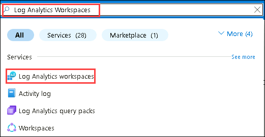
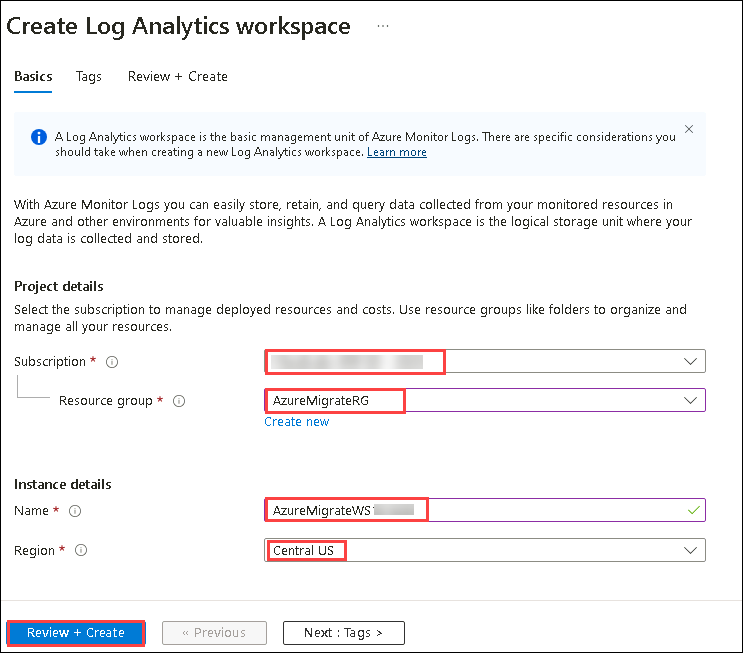

# Lab 01: Secure Infra workloads with Defender for Cloud 

### Enable Microsoft Defender for Cloud, Microsoft Sentinel, and Azure Monitor, and setup Log analytics for each source

In this Guided Lab, you will learn how to enable enhanced security features by enabling the Defender for Cloud plans through the Azure portal. The Defender plans show you the monitoring coverage for each Defender plan. You will be enabling the same for Microsoft Sentinel and Azure Monitor. Also, you will set up a Log Analytics workspace to collect logs and data of the resources and its information will be stored in a workspace.

> **Note:** 
> - Microsoft Defender for Cloud, Azure Sentinel and Monitor Insights can take several hours to surface after the completion of a scan.
> - At this point of the workshop, only a limited number of data visualizations may be populated. (So the result in the screenshots below may vary)
> - The screenshots and information below, have been provided so that you can conceptualise the type of graphs and output that can be gleaned from a fully populated environment.

### Task 1: Enable Microsoft Defender for Cloud

1. If you are not logged in already, click on the Azure portal shortcut that is available on the desktop and log in with below Azure credentials below.
    
    * Azure Username/Email: <inject key="AzureAdUserEmail"></inject> 
    
    * Azure Password: <inject key="AzureAdUserPassword"></inject>

2. In the **search resources, services and docs bar**, type **Log Analytics Workspaces** and select it from suggestions, as shown below:

    
   
4. Select **+ Create** on the Log Analytics workspaces page.
   
5. Within the Create Log Analytics workspace pane, enter the following details:
   
   * Subscription: Select the default subscription.
     
   * Resource Group: **AzureMigrateRG**.
     
   * Name : Enter **AzureMigrateWS<inject key="Deployment ID" enableCopy="false"/>** .
     
   * Location: Select the default **location**.

      
     
6. Click on **Review + Create** then click on **Create** and wait for the deployment to complete.
   
7. once the deployment is completed, In the **search resources, services and docs bar**, type **Microsoft Defender for Cloud** and select it from suggestions, as shown below:

    
    
    > **Note:** If you are prompted with a new upgrade pop-up, click on Skip.
    
9. On the **Microsoft Defender for Cloud** page, click on **Environment settings (1)** and click on the **down arrow (2)** of your subscription name and click on **AzureMigrateWS<inject key="DeploymentID" enableCopy="false" /> (3)**.

     
     
10. On the **Defender plans** page, switch the plan blade **On for Servers (1)** and then click on **Save (2)**.    

    
    
11. Go back to the **Getting started (1)** page Microsoft Defender for Cloud, under the **Upgrade tab (2)** select **AzureMigrateWS<inject key="DeploymentID" enableCopy="false" /> (3)** workspace and click on **Upgrade (4)**.

    .png "setup workspace")

12. From Defender for Cloud’s menu, open **Environment settings**.

13. Select the your subscription.

14. In the Settings & monitoring Coverage column of the Defender plans, select **Settings & monitoring**.

15. In the Log Analytics row, in the Configuration column, click **Edit configuration**.

16. In the Auto-provisioning configuration template complete the following actions:

    Under Workspace selection, click Custom workspace.

    Click the dropdown menu and select your previously created workspace.

    Under Security events storage, click the dropdown menu and, select All Events.

    At the bottom of the Auto-provisioning template, click Apply.
   
    .png "setup workspace")
    
     > **Note:** It might take up to 24-48 hours for all the changes to get reflected in your subscription successfully.
   
1. The **Microsoft Defender for Cloud Overview page** offers a consolidated perspective for security experts. This section combines various independent cloud security components, such as **Secure Score, Regulatory Compliance, and Workloads Protection**, and provides detailed insights on the security posture on a distinct dashboard.

    

1. On the **Recommendations page** under _General_, pay attention to the first part of the page. It includes the current Secure Score, progress on the Recommendations status (both completed security controls and recommendations), and Resource health (by severity).
    
    
   
1. On the **Security alerts page** under _General_, you can see the alerts that describe details of the affected resources, suggested remediation steps, and in some cases an option to trigger a logic app in response. (The Remediation steps contain the remediation logic where you can remediate the selected resource/s. To simplify remediation improve your environment's security and increase your secure score, many recommendations include a Fix option. Fix helps you quickly remediate a recommendation on multiple resources.)

### Task 2: Enable Microsoft Sentinel

1. In the **search resources, services and docs bar**, type **Microsoft Sentinel** and select it from suggestions, as shown below:

    
    
1. On the **Microsoft Sentinel** page, click on **+ Create**.    

    
        
1. On the **Add Microsoft Sentinel to a Workspace** page, select the **AzureMigrateWS<inject key="DeploymentID" enableCopy="false" /> (1)** workspace and click on **Add (2)**. If prompted, the Microsoft Sentinel free trial is activated, click on OK.   

    
    
    > **Note:** If you are prompted with the Microsoft Sentinel free trial activated pop-up, click on ok.
    
1. On the **News and guides (1)** window, go to **Get started (2)** tab review the content and from left pane under **Configuration**, select **Data connectors**.   

    
    
1. You will now be directed to the **Data Connectors** page. Microsoft Sentinel comes with many connectors for Microsoft solutions that are available out of the box and provide real-time integration. For non-Microsoft solutions, Microsoft Sentinel provides built-in interfaces to the larger security and application ecosystems.

    

1. From the left pane, select **Analytics** present under _Configuration_. You can create custom analytics rules to help discover threats and anomalous behaviours in your environment. (Analytics rules search for specific events or sets of events across your environment, alert you when certain event thresholds or conditions are reached, generate incidents for your SOC to triage and investigate, and respond to threats with automated tracking and remediation processes.) 

    

> **Congratulations** on completing the task! Now, it's time to validate it. Here are the steps:
> - If you receive a success message, you can proceed to the next task.
> - If not, carefully read the error message and retry the step, following the instructions in the lab guide. 
> - If you need any assistance, please contact us at labs-support@spektrasystems.com. We are available 24/7 to help you out.

<validation step="2bc40646-bf54-4cb9-bfad-e02d398693c8" />

### Task 3:  Enable Azure Monitor

1. In the **search resources, services and docs bar**, type **Monitor** and select it from suggestions, as shown below:

    .png "Azure Monitor")
    
1. From the left pane, select **Log Analytics Workspaces (1)** present under Insights (You will see your subscription and all the workspaces in it, listed here) and click on **AzureMigrateWS<inject key="DeploymentID" enableCopy="false" /> (2)** workspace under azure migrate rg.

    

1. On the **Overview tab**, you can see:

   - The monthly ingestion volume of the workspace

   - How many machines sent heartbeats, meaning - machines that are connected to this workspace (in the selected time range)

   - Machines that haven't sent heartbeats in the last hour (in the selected time range)

   - The data retention period set

   - The daily cap set, and how much data was already ingested on the recent day

   - Ingestion anomalies - a list of identified spikes and dips in ingestion to these tables
    
    
    
1. On the **Usage tab**, you can see ingestion data by tables and defaults to the 5 most ingested tables in the selected time range.

   - How much data was ingested to it (during the selected time range)

   - The percentage this table takes, from the entire ingestion volume (during the selected time range). That helps identify the tables that affect your ingestion the most.

   - When was the last update of usage statistics regarding each table - we normally expect usage stats to refresh hourly.
   
      
    
1. On the **Health tab**, you can see the workspace's health state and when it was last reported, as well as operational errors and warnings.
        
     
    
1. On the **Agents tab**, you can see:

   - Operation errors and warnings - these are errors and warnings related specifically to agents. 

   - Workspace agents - these are the agents that send logs to the workspace during the selected time range. You can see the agent's types and health state. 

   - Agents activity - this grid shows information on either all agents, healthy or unhealthy agents. 
    
    

> **Congratulations** on completing the task! Now, it's time to validate it. Here are the steps:
> - If you receive a success message, you can proceed to the next task.
> - If not, carefully read the error message and retry the step, following the instructions in the lab guide. 
> - If you need any assistance, please contact us at labs-support@spektrasystems.com. We are available 24/7 to help you out.

 <validation step="429df833-4ba9-4dcb-88e5-f48a509ac964" />
  
    
**Summary:** In this exercise, you explored what is Microsoft Defender and how to enable it for Cloud and Microsoft Sentinel. You also learnt about Monitoring which helps you maximize the availability and performance of your applications and services. Then you explored how Azure Monitor Logs stores the data that it collects in the Log Analytics workspaces.
