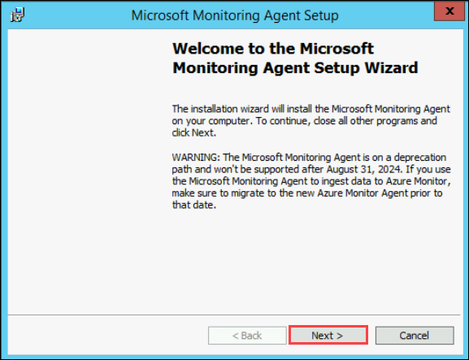
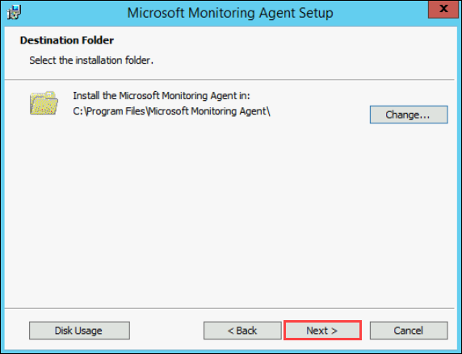
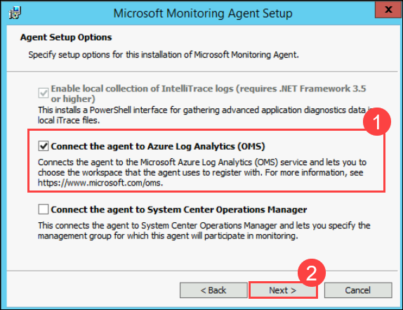
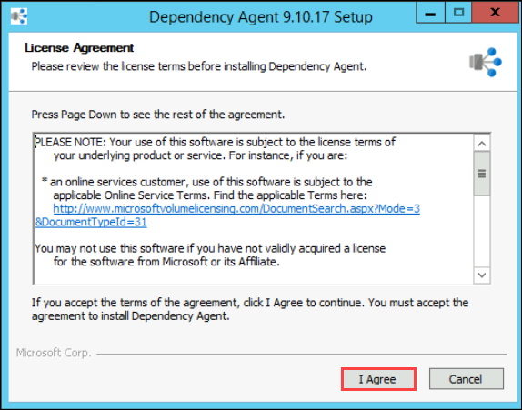
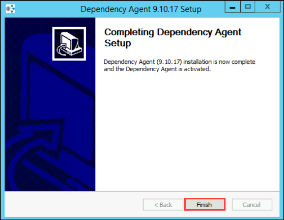

# HOL1: Exercise 2: Set up your environment on Azure to migrate servers

### Estimated time: 40 minutes

In this exercise, you'll assess the migration readiness of the SmartHotel application using Azure Migrate. First, you'll create an assessment for selected VMs, setting up and grouping them to generate a report that shows whether they're ready for migration to Azure.

Next, you'll configure dependency visualization by installing monitoring agents on the VMs. This will help you map out and understand the dependencies between different application parts, ensuring everything works properly before migrating to Azure.

## Lab objectives

In this exercise, you will complete the following tasks:

- Task 1: Create a migration assessment
- Task 2: Configure dependency visualization

### Task 1: Create a migration assessment

In this task, you will use Azure Migrate to create a migration assessment for the SmartHotel application, using the data gathered during the discovery phase.

1. Select **Assess (1)** under **Azure Migrate: Discovery and assessment** and click on **Azure VM (2)** to start a new migration assessment.

    

2. On the Basics blade, ensure the Assessment type is **Azure VM** and the Discovery Source is **Servers discovered from Azure Migrate Appliance**. Under **Assessment settings**, select **Edit**.

    

3. The **Assessment settings** blade allows you to tailor many settings used when making a migration assessment report. Take a few moments to explore the wide range of assessment properties. Hover over the information icons to see more details on each setting. Choose any settings you like, then select **Save**. (You have to make a change for the Save button to be enabled; if you don't want to make any changes, close the blade.)

    

4. Select **Next** to move to the **Select servers to assess** tab and enter the following information:
     
     1. Assessment name: Enter **SmartHotelAssessment (1)** 
     1. Select or create a group: Choose **Create new (2)**  
     1. Enter the Group name: **SmartHotel VMs (3)**
     1. Add machines to the Group:  Select **SmarthotelAppl (Hyper-V) (4)** from the dropdown.
     1. Select the **smarthotelweb1**, **smarthotelweb2**, **UbuntuWAF**, and **redhat** VMs **(5)**
     1. Click on **Next: Review + create assessment > (6)**.

        

        > **Note**: There is no need to include the **smarthotelSQL1**, **AzureMigrateAppliance** and other VMs in the assessment, since they will not be migrated to Azure.
        
        > **Note**: Please note that even though we are adding **Redhat** VM to the assessment here, we will not be setting up our environment in Redhat VM in this exercise. Users will review the assessment and perform all the steps for environment setup in HOL2.
    
5. Click on **Create assessment** to create the assessment. 

    

6. In Azure Migrate, on the **Servers, databases, and web apps** blade, select **Refresh** periodically until the number of assessments shown is **1** (This may take a few minutes). Once the assessments count is updated, click on **1** that is next to **Total** under **Assessments**.  

    ")
    
7. Select **Assessments (1)** under **Azure Migrate: Discovery and assessment** to see a list of assessments. Then select the **actual assessment (2)**.

    ")

     > **Congratulations** on completing the task! Now, it's time to validate it. Here are the steps:
     > - Hit the Inline Validate button for the corresponding task. If you receive a success message, you can proceed to the next task. 
     > - If not, carefully read the error message and retry the step, following the instructions in the lab guide.
     > - If you need any assistance, please contact us at cloudlabs-support@spektrasystems.com. We are available 24/7 to help.

     <validation step="b1bc5f5b-6e26-451d-883a-842902f61bdc" />

### Task 2: Configure dependency visualization

When migrating a workload to Azure, it is important to understand all workload dependencies. A broken dependency could mean that the application does not run properly in Azure, perhaps in hard-to-detect ways. Some dependencies, such as those between application tiers, are obvious. Other dependencies, such as DNS lookups, Kerberos ticket validation or certificate revocation checks, are not.

In this task, you will configure the Azure Migrate dependency visualization feature. This requires you to first create a Log Analytics workspace and then deploy agents on the to-be-migrated VMs.

1. Return to the **Azure Migrate** blade in the Azure Portal, select **Servers, databases and web apps (1)**. Under **Discovery and assessment** select **Groups (2)**.

    

2. Under the **Groups (1)** pane, select the **SmartHotel VMs (2)** group to see the group details. 

    

3. Note that each VM has their **Dependencies** status as **Requires agent installation**. Select **Requires agent installation** for the **smarthotelweb1** VM.

    

4. On the **Dependencies** blade, select **Configure Log Analytics workspace**.

    

5. On the **Configure Log Analytics workspace** blade, provide the below information and select **Configure (4)**.

   - Log Analytics workspace: Click on **Create new (1)** and enter **AzureMigrateWS<inject key="DeploymentID" enableCopy="false" /> (2)**
   - Log Analytics workspace location: Select **East US (3)** from the dropdown.

        

6. Wait for the workspace to be deployed. Once it is deployed, navigate to **AzureMigrateWS<inject key="DeploymentID" enableCopy="false" />** by clicking on it.

    

     > **Note**: If you don't see the workspace here. You can attempt to close and reopen the Workspace, or you can try refreshing the browser page. This may have been caused by a temporary error in the portal.

7. Select **Agents (1)** under **Settings** from the left-hand side menu. Make a note of the **Workspace ID (2)** and **Primary Key (3)** (for example by using Notepad).

    

8. Return to the Azure Migrate **Dependencies** blade. Copy each of the 4 agent download URLs and paste them alongside the Workspace ID and key you noted in the previous step. 
   
    

9. From **Hyper-V Manager** console, select **smarthotelweb1 (1)** and select **Connect (2)**.

    

10. Select **Connect** again when prompted and log in to the **Administrator** account using the password **<inject key="SmartHotel Admin Password" />**.

11. Go to **Start** button in the **smarthotelweb1** VM and select **Internet Explorer** to open it. Paste the link to the 64-bit Microsoft Monitoring Agent for Windows, which you noted earlier. When prompted, **Run** the installer.

     > **Note**: You may need to disable **Internet Explorer Enhanced Security Configuration** on **Server Manager** under **Local Server** to complete the download. 

    

12. On the **Welcome to the Microsoft Monitoring Agent Setup Wizard** blade, select **Next**. 

    

13. On the **Microsoft Software License Terms** blade, select **I Agree**.

    

14. On the **Destination Folder** blade, leave everything as default and select **Next**. 

     

15. On the **Agent Setup Options** blade, select **Connect the agent to Azure Log Analytics (OMS) (1)** and select **Next (2)**.

     

16. On the **Azure Log Analytics** blade, enter the **Workspace ID** and **Workspace Key** that you copied earlier, and select **Azure Commercial (1)** from the Azure Cloud drop-down then select **Next (2)**.

    

17. On the **Microsoft Update** blade, leave everything as default and select **Next**. 

    

18. On the **Ready to Install** blade, click on **Install**. 

    

19. Select **Finish** to finish the installation process of **Microsoft Monitoring Agent for Windows**.

    

20. Paste the link to the **Dependency Agent Windows installer** into the browser address bar. **Run** the installer.

    

21. On the **License Agreement** blade, select **I Agree** to accept the agreement and continue. 

     

22. On the **Completing Dependency Agent Setup** blade, select **Finish** to finish the installation process.

     

    > **Note**: You do not need to configure the workspace ID and key when installing the Dependency Agent, since it uses the same settings as the Microsoft Monitoring Agent, which must be installed beforehand.

23. Close the virtual machine connection window for the **smarthotelweb1 VM**. Connect to the **smarthotelweb2 VM** and repeat the installation process (steps 10-22) for both agents (the administrator password is the same as for smarthotelweb1). Close the virtual machine connection window for the **smarthotelweb2 VM**, once the installation of agents is done.

24. Open a command prompt using the desktop shortcut.  

    > **Note**: The SmartHotelHost runs Windows Server 2019 with the Windows Subsystem for Linux enabled. This allows the command prompt to be used as an SSH client. More info on supported Linux on Azure can be found here: https://Azure.com/Linux. 

25. Enter the following command to connect to the **UbuntuWAF** VM running in Hyper-V on the SmartHotelHost:

    ```bash
    ssh demouser@192.168.0.8
    ```

26. Enter 'yes' when prompted whether to connect. Use the password **<inject key="SmartHotel Admin Password" />**.

    

27. Enter the following command, followed by the password **<inject key="SmartHotel Admin Password" />** when prompted:
  
    ```
    sudo -s
    ```

    > This gives the terminal session elevated privileges.

28. Enter the following command, substituting \<Workspace ID\> and \<Primary Key\> with the values copied previously. Answer **Yes** when prompted to restart services during package upgrades without asking.  

    ```
    wget https://raw.githubusercontent.com/Microsoft/OMS-Agent-for-Linux/master/installer/scripts/onboard_agent.sh && sh onboard_agent.sh -w <Workspace ID> -s <Primary Key>
    ```

    
    
    > **Note**: If you receive any error while running the above command, run the below command to update the packages and perform **Step 28** again.
     
     ```
     apt-get update
     ```

29. Enter the following command, substituting \<Workspace ID\> with the value copied earlier:

    ```s
    /opt/microsoft/omsagent/bin/service_control restart <Workspace ID>
    ```

30. Enter the following command. This downloads a script that will install the Dependency Agent.

    ```s
    wget --content-disposition https://aka.ms/dependencyagentlinux -O InstallDependencyAgent-Linux64.bin
    ```

31. Install the dependency agent by running the script download in the previous step.

    ```s
    sh InstallDependencyAgent-Linux64.bin -s
    ```

    
    

32. Return to the Azure Portal and refresh the Azure Migrate **SmartHotel VMs** VM group blade. The 3 VMs on which the dependency agent was installed should now show their status as **Installed**. (If not, refresh the page **using the browser refresh button**, not the refresh button in the blade.  It may take up to **5 minutes** after installation for the status to be updated.)

    
   
    **Note**: If you notice that the dependency agent status is showing as **Requires Agent Installation** instead of Installed even after installing dependency agents in all the three VMs, please follow the steps from [here](https://github.com/CloudLabsAI-Azure/Know-Before-You-Go/blob/main/AIW-KBYG/AIW-Infrastructure-Migration.md#4-exercise1---task6---step1) to confirm dependency agent installation in VMs using Log Analytics workspace.
 
33. Select **View dependencies**.

    
   
34. Take a few minutes to explore the dependencies view. Expand each server to show the processes running on that server. Select a process to see process information. See which connections each server makes.

    

     > **Congratulations** on completing the task! Now, it's time to validate it. Here are the steps:
     > - Hit the Inline Validate button for the corresponding task. If you receive a success message, you can proceed to the next task. 
     > - If not, carefully read the error message and retry the step, following the instructions in the lab guide.
     > - If you need any assistance, please contact us at cloudlabs-support@spektrasystems.com. We are available 24/7 to help.

     <validation step="76903306-f337-49dc-99b9-2e46e1c17fbe" />

### Summary 

In this exercise, you created and configured a migration assessment in Azure Migrate and its dependency visualization feature, by creating a Log Analytics workspace and deploying the Azure Monitoring Agent and Dependency Agent on both Windows and Linux on-premises machines.

Click on **Next** from the lower right corner to move on to the next page.
