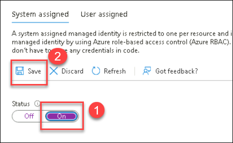
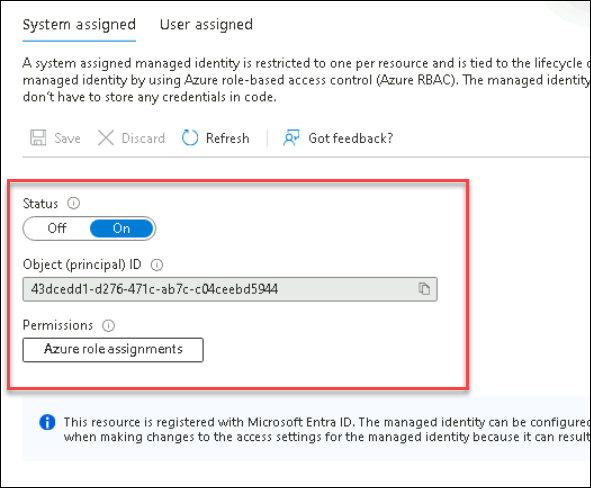
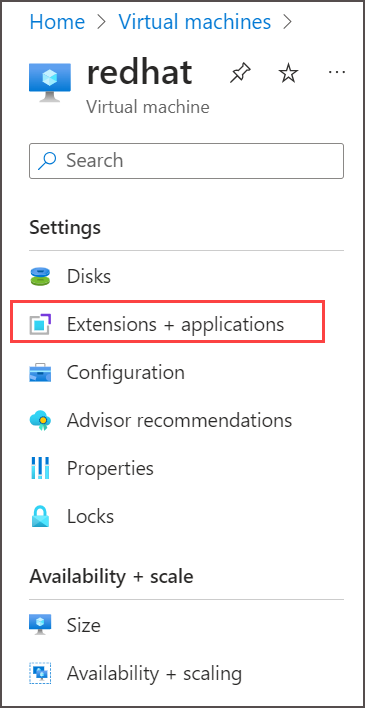
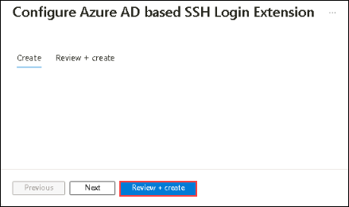

## HOL2: Exercise 4: Optimizing newly migrated workloads, and emphasizing commonalities across all stacks

### Estimated time: 40 minutes

In this exercise, you will enable Azure Active Directory (AAD) authentication and Managed Identity on virtual machines by deploying a VM extension. Additionally, you'll activate Automanage on existing machines to streamline configuration and monitoring. This process simplifies identity management and automates the operational tasks necessary for managing VMs efficiently in Azure, ensuring enhanced security and compliance across your cloud environment.

## Lab objectives

In this exercise, you will complete the following tasks:

- Task 1: Getting Started with Azure Active Directory for Linux
- Task 2: Azure auto manage

### Task 1: Getting Started with Azure Active Directory for Linux 

In this task, you will be enabling the AAD authentication using a VM extension and enabling Managed identity. 

1. In the Azure portal `https://portal.azure.com`, Navigate to your newly migrated **redhat** VM and select it.
    
    
    
2. Now from the left side menu, select the **Identity** under Security.

    

3. In Identity, Under the System assigned tab, Click on the **On (1)** button under the Status tag and click on the **Save (2)** button to turn on the identity. It will take some time to complete the process and some Service principles are being created behind the process.

     > **Note**: If prompted with the Enable system-assigned managed identity pop-up, click on Yes.

      

      
      
4. Now, Navigate to **Extensions + applications** under Settings from the left side menu.
   
    

5. On the Extension page, click on the **+ Add** button to add an extension that will help you connect to your machine using your AAD account.

    

6. Once you are on the **Install an extension** page, search for **Azure AD based SSH Login** extension select it and click on the **Next** button.

    

7. You will be redirected to the **Configure Azure AD based SSH Login extension** page, now click on **Review + create** and then **Create** button. It should start the installation of the extension into your Redhat VM.

    
    
    

8. Once you have the extension installed, please move to the next task.

    

     > **Congratulations** on completing the task! Now, it's time to validate it. Here are the steps:
     > - Navigate to the Lab Validation Page, from the upper right corner in the lab guide section.
     > - Hit the Validate button for the corresponding task. If you receive a success message, you can proceed to the next task. 
     > - If not, carefully read the error message and retry the step, following the instructions in the lab guide.
     > - If you need any assistance, please contact us at cloudlabs-support@spektrasystems.com. We are available 24/7 to help.

     <validation step="31b52d30-b336-49c3-a5bc-4ef69b15dd76" />

### Task 2: Azure auto manage

In this task, you will Enable Automanage on existing machines.

1. If you are not logged in already, click on the Azure portal shortcut that is available on the desktop and log in with below Azure credentials.
    * Azure Username/Email: <inject key="AzureAdUserEmail"></inject> 
    * Azure Password: <inject key="AzureAdUserPassword"></inject>

2. In the search bar, search for and select **Automanage**.

3. Select **Automanage machines (1)** under Azure machine best practices and click on **+ Enable on existing machine (2)**.
   
   

4. Under **Configuration profile**, select your profile type: **Azure Best Practices - Production or Azure Best Practices - Dev/Test or Custom profile** and select **Next: Machines >**.
   
   
   
   > **Note:** Click View best practice profiles to see the differences between the environments.
    
   

5. On the Select **machines blade**:

   i. Filter the list by your Subscription and Resource group and click on **Check eligibility on machines (2)**.
   
   ii. Check the checkbox of **redhat (1)** virtual machine.
   
   iii. Click the **Review + Create (3)** button.
   
   

6. Click on **Create**.

7. Once the Configuration profile assignment is completed successfully, it will take around 5-10 minutes to get the Status as Conformant.

### Summary

In this exercise, you enabled Azure Active Directory (AAD) authentication and Managed Identity on virtual machines by deploying a VM extension. Additionally, you activated Automanage on existing machines to streamline configuration and monitoring. This process simplified identity management and automated the operational tasks necessary for managing VMs efficiently in Azure, ensuring enhanced security and compliance across the cloud environment.

Click on **Next** from the lower right corner to move on to the next page.
